# FlickIt Backend - Architecture Diagrams

## 📊 System Architecture Overview


## 🔐 Authentication & Authorization Flow


## 🎯 Event Management Flow


## 🏗️ Module Dependencies


## 🔄 Data Flow for Event Rating


## 🗄️ Database Schema


## 🚀 API Endpoint Structure

```mermaid
graph TD
    subgraph "Public Endpoints"
        P1[POST /users - Registration]
        P2[POST /auth/login - Login]
        P3[GET /events/latest - Search Events]
        P4[GET /ai/health - AI Health Check]
    end
    
    subgraph "Customer Endpoints"
        C1[GET /users/me - Profile]
        C2[PUT /events/{id}/claim - Claim Event]
        C3[POST /ratings - Rate Event]
        C4[POST /notifications/subscribe - Subscribe]
        C5[GET /notifications/subscriptions - List Subscriptions]
        C6[DELETE /notifications/unsubscribe - Unsubscribe]
    end
    
    subgraph "Vendor Endpoints"
        V1[POST /events - Create Event]
        V2[GET /users/me - Profile]
        V3[POST /ai/generate-content - AI Content]
    end
    
    subgraph "Admin Endpoints"
        A1[POST /ai/test - Test AI]
        A2[POST /auth/token - Generate Token]
        A3[POST /auth/test-token - Test Token]
    end
    
    P1 --> C1
    P2 --> C1
    P2 --> V1
    P2 --> A1
```

## 🔧 Security Configuration

```mermaid
graph LR
    subgraph "Security Chain"
        A[HTTP Request] --> B[CSRF Filter]
        B --> C[JWT Authentication Filter]
        C --> D[Authorization Filter]
        D --> E[Controller]
    end
    
    subgraph "JWT Processing"
        C --> F[Extract Token]
        F --> G[Validate Token]
        G --> H[Set Security Context]
    end
    
    subgraph "Role-Based Access"
        D --> I[Check @PreAuthorize]
        I --> J{Has Role?}
        J -->|Yes| E
        J -->|No| K[403 Forbidden]
    end
    
    subgraph "Public Endpoints"
        L[/users] --> M[Permit All]
        N[/events/latest] --> M
        O[/ai/health] --> M
        P[/v3/api-docs/**] --> M
        Q[/swagger-ui/**] --> M
    end
```

## 📱 Notification Flow


## 🧪 Testing Strategy


## 📊 Performance Metrics

```mermaid
graph LR
    subgraph "Response Times"
        RT1[< 100ms - Health Checks]
        RT2[< 500ms - Simple Queries]
        RT3[< 2000ms - AI Generation]
        RT4[< 1000ms - Complex Queries]
    end
    
    subgraph "Throughput"
        T1[1000 req/s - Read Operations]
        T2[100 req/s - Write Operations]
        T3[50 req/s - AI Operations]
    end
    
    subgraph "Availability"
        A1[99.9% - Core Services]
        A2[99.5% - AI Services]
        A3[99.99% - Health Endpoints]
    end
    
    subgraph "Scalability"
        S1[Horizontal Scaling]
        S2[Database Connection Pooling]
        S3[Async Processing]
        S4[Caching Strategy]
    end
```



---

## 📝 How to Use These Diagrams

### **Mermaid Live Editor**
1. Go to [https://mermaid.live/](https://mermaid.live/)
2. Copy any diagram code from above
3. Paste into the editor
4. View rendered diagram
5. Export as PNG/SVG

### **GitHub Integration**
- GitHub automatically renders Mermaid diagrams in markdown files
- Just commit this file to your repository
- Diagrams will be visible in README.md or any markdown file

### **Documentation Updates**
- Update diagrams when architecture changes
- Keep examples current with actual API responses
- Add new diagrams for new features

### **Team Collaboration**
- Use diagrams in technical discussions
- Include in API documentation
- Reference in development tickets
- Share with frontend team for integration planning
